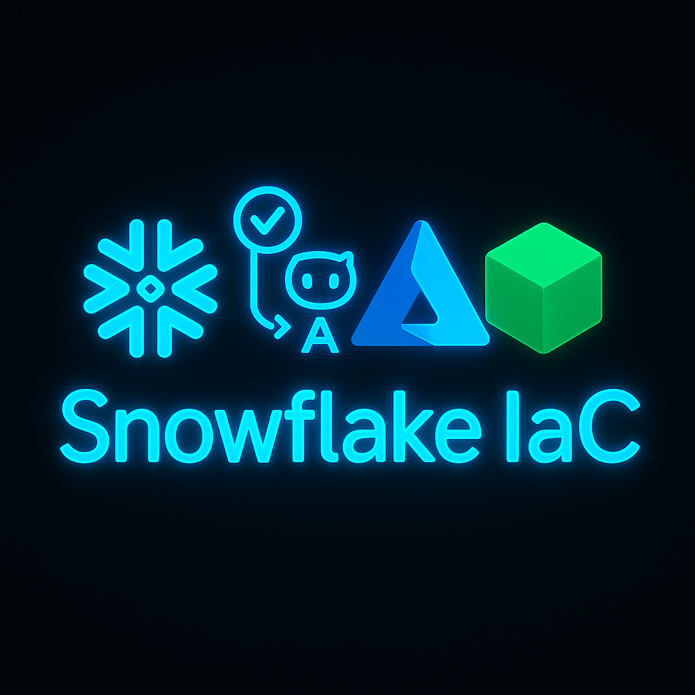

# Snowtofu

Effortlessly deploy Snowflake objects using Tofu (open-source Terraform).



## Set Up GitHub Actions with Azure OIDC

Authenticate your GitHub Actions workflows securely with Azure using OpenID Connect (OIDC). Configure this by following the official [Azure Login Action documentation](https://github.com/marketplace/actions/azure-login).

### Required GitHub Secrets for Azure

* `AZURE_CLIENT_ID`
* `AZURE_SUBSCRIPTION_ID`
* `AZURE_TENANT_ID`

Add these secrets in your repository under **Settings > Security > Secrets and variables > Actions**.

### Storage Account Permisissions

Make sure that AZURE_CLIENT_ID identity has the role Storage `Blob Data Owner` in the storage account.

#### Required GitHub Secrets for OpenTofu to store state file in Azure Storage account

* `TF_VAR_RESOURCE_GROUP_NAME` The name of the resource group of the Storage account
* `TF_VAR_STORAGE_ACCOUNT_NAME` The name of the storage account where the identity `AZURE_CLIENT_ID` has `Blob Data Owner` and OpenTofu will store the [remote state](https://opentofu.org/docs/language/state/remote/).

## Configure Snowflake Authentication

You'll use key-pair authentication for your Snowflake service user.

Generate keys using the following commands:

```shell
openssl genrsa 2048 | openssl pkcs8 -topk8 -inform PEM -out snowflake_tf_snow_key.p8 -nocrypt
openssl rsa -in snowflake_tf_snow_key.p8 -pubout -out snowflake_tf_snow_key.pub
```

Copy the contents of `snowflake_tf_snow_key.pub`, including the headers and footers, and create a service user in Snowflake:

```sql
USE ROLE ACCOUNTADMIN;

CREATE USER TERRAFORM_SVC
    TYPE = SERVICE
    COMMENT = "Service user for Terraforming Snowflake"
    RSA_PUBLIC_KEY = "-----BEGIN PUBLIC KEY-----\nYourPublicKeyHere\n-----END PUBLIC KEY-----";

GRANT ROLE SYSADMIN TO USER TERRAFORM_SVC;
GRANT ROLE SECURITYADMIN TO USER TERRAFORM_SVC;
```

Detailed documentation on this process can be found [here](https://docs.snowflake.com/en/user-guide/key-pair-auth).

## GitHub Secrets for Snowflake Deployment

In your repository settings (**Settings > Security > Secrets and variables > Actions**), add these additional secrets:

* `TF_VAR_ORGANIZATION_NAME`: Your Snowflake organization name
* `TF_VAR_ACCOUNT_NAME`: Your Snowflake account name
* `TF_VAR_PRIVATE_KEY_PATH`: Path on the GitHub Actions runner to store the private key file
* `SNOWFLAKE_PRIVATE_KEY`: The contents of your `snowflake_tf_snow_key.p8` file

You're now ready to deploy Snowflake resources using Tofu!


## Folder overview

| File | Role |
|------|------|
| `main.tf` | Declares: <br>• AzureRM backend (storage account, container, key) – tenant / client / subscription IDs are injected at runtime via `tofu init -backend-config`. <br>• Snowflake provider that authenticates with the RSA key. <br>• Two demo resources (`snowflake_database`, `snowflake_warehouse`). |
| `.github/workflows/tofu_plan.yml` | CI pipeline: <br>1. Checkout repo. <br>2. Install OpenTofu. <br>3. Azure OIDC login. <br>4. Write `SNOWFLAKE_PRIVATE_KEY` to `TF_VAR_PRIVATE_KEY_PATH`. <br>5. `tofu init` with backend-config values from secrets. <br>6. `tofu plan` (on PR) and `tofu apply` (on main / manual). |
